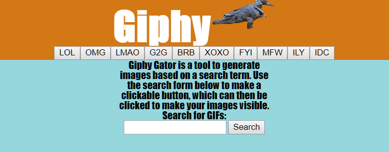
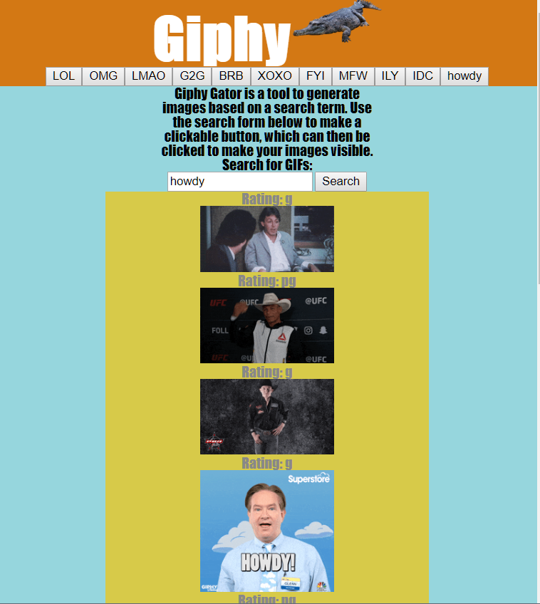

# giphy-gator
A user interface for searching and displaying images from the Giphy API

### Instructions:
Either click a button to query the text of that button, or create your own button using the search form. Click on an image to start or stop animation.

### Screenshots:

#### Languages used:
* JavaScript/jQuery
* HTML/CSS

#### New concepts learned and integrated:
* API/AJAX calls
* Media queries (always just used Bootstrap before!)
